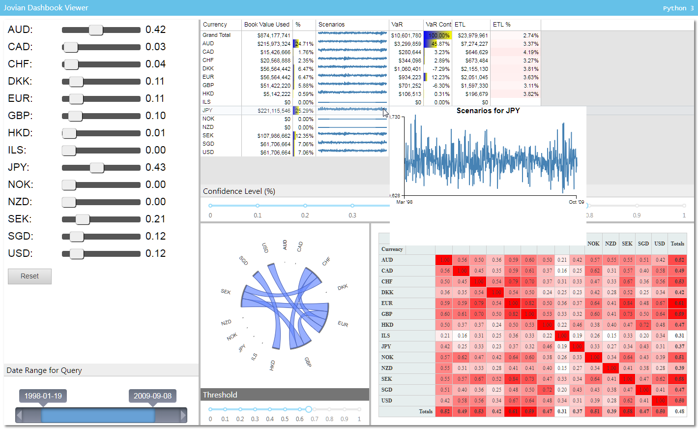

# MavenWorks

**MavenWorks** is an open-source dashboarding framework offering uniquely flexible and user-friendly ways to quickly build dashboards and analytical applications.


_<sup>Bond Portfolio demo on MavenWorks Viewer 0.1.0-alpha</sup>_

Try the hosted standalone version [MavenWorks Standalone!](https://mavenomics.github.io/MavenWorks/app) and [MavenWorks Standalone Demos](http://mavenworks.com/app/demos/)

Or the JupyterLab version on Binder! [](https://mybinder.org/v2/gh/Mavenomics/MavenWorks/binder?urlpath=lab%2Ftree%2Fdemos%2FStartHere.ipynb)

# Key Concepts

 * **Parts**: Highly interactive dashboards can be built with straightforward drag-and-drop and configuration from the included extensible and scriptable gallery of visual Parts such as tables, charts, sliders and dropdowns, and the Jupyter version can also optionally use any charting libraries or interactive widgets available in JupyterLab. Almost anything that can be displayed in a web page or Jupyter notebook can also be put into a Dashboard!

 * **Layouts**: Parts are laid out into dashboards using an extensible palette of tabs, free-form canvases, and docking stack panels that automatically resize to make best use of screen real-estate.  The layouts can be created implicitly  by WYSIWYG drag and drop or a layout "tree" can be precisely configured in a visual Designer.

 * **Bindings**: To automatically connect Parts to data and calculations MavenWorks supplies a Data Binding framework and a query engine for fetching data and computing analytics, which, when the no-code or low-code approach isn't enough can usa any mix of Javascript, a powerful SQL dialect called MQL and (if using Jupyter) Python from right within your dashboard!  The underlying framework will take care of the complicated plumbing for executing bindings at the right time and keep displays, data and analytics all in sync.

# Flexible Deployment options
 * **Standalone**: MavenWorks can run purely standalone and isolated on a web-browser from any web server.  No back-end server required!
 * An optional **Configuration Server** allows for better sharing of dashboards and more.
 * Optional **JupyterLab** integrations offer shared dashboard construction and embedding in Jupyter notebooks, with bindings that can run client-side or straightforwardly use a notebook's Python kermel.  MavenWorks for JupyterLab also include a simple **viewer** for a great way to share dashboards with end-users.

# Getting Started
You can read our documentation [here](https://mavenomics.github.io/MavenWorks) on GitHub pages, where We have tutorials,
reference docs, and contributor documentation. Most of the documentation is also accessible in-app using
the <kbd>F1</kbd> Help key.

MavenWorks is under heavy development so if you have questions or see something you don't like file an issue right here on GitHub or contact support@mavenomics.com .

## Getting started Standalone
Here's a hosted [standalone app](https://mavenomics.github.io/MavenWorks/app/) where you can start building dashboard application from scratch following the tutorials, or  can navigate between pre-built [examples demos](https://mavenomics.github.io/MavenWorks/app/demos/index.html) to help you understand what MavenWorks
can do.

[//]: # (we should also soon outline simple host-your-own and link to CLI documentation) 

## Getting Started with JupyterLab

You can try out a hosted JupyterLab experience live on on Binder! [](https://mybinder.org/v2/gh/Mavenomics/MavenWorks/binder?urlpath=lab)

Or to install the JupyterLab extension in an existing environment simply run these commands:

```sh
$ pip install mavenworks
$ jupyter serverextension enable --py mavenworks.server
$ jupyter labextension install jupyterlab-mavenworks
```

[//]: # (should we also provide or link to more general installation instructions?)


Jupyter deployments come with several demo Notebooks and Dashboards, and scripted Part extensions that
demonstrate parts of the API. Use the [Start Here](./demos/StartHere.ipynb)
notebook to access these demos, and refer to our [Getting Started](https://mavenomics.github.io/MavenWorks/docs/user/getting-started.md)
guide or contact support@mavenomics.com for additional help.


