# Hello Dashboards!

<!-- note: clarify what "editor" means here -->

With MavenWorks setup and ready to go, open up the Dashboard Editor. You should be
greeted by an empty dashboard, with the "Add New Part" button:

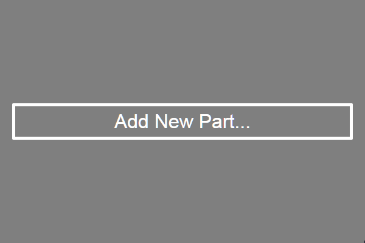

Click the button, or press <kbd>Alt</kbd>+<kbd>Shift</kbd>+<kbd>T</kbd>, and
select "SliderPart" and hit OK.

You should now see a Slider in your dashboard:

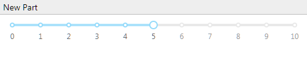

Now, right-click on the slider and click "Edit Value Binding..." or press
<kbd>Ctrl</kbd>+<kbd>E</kbd>, <kbd>Ctrl</kbd>+<kbd>B</kbd> to bring up the
binding editor. In the dialog, type "MyGlobal" and hit OK.

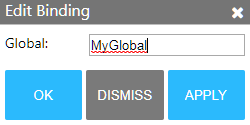

Finally, right-click and press "Duplicate Part".

Now move one slider, and watch as the other updates!

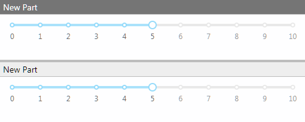

# Anatomy of a Dashboard

To understand how this works, let's pick apart the dashboard and see what's
going on under the hood. There are 3 major components to a dashboard:

 1. [Parts](#parts)
 2. [Bindings](#bindings)
 3. [Layout](#layout)

## Parts

Parts are the building blocks of an interactive dashboard. They consist of a
view (such as a graph, or a slider), and a set of "options."

<!-- note: properties -> options confusion -->

Right-click on one slider and hit "Edit Part Properties...". This will let us
see the part options:

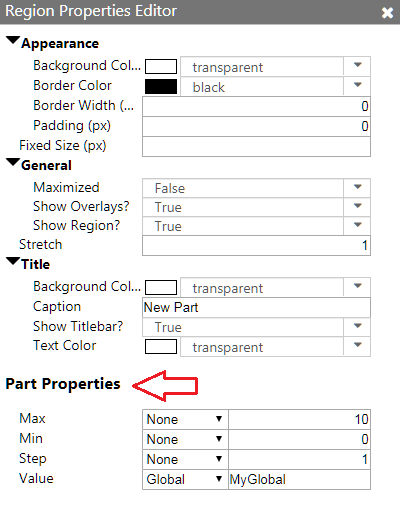

These options are how the slider communicates with the rest of the dashboard.

Let's try a simple change to one of these options! Set the "Step" option to
2, and notice that the slider now skips odd numbers.

## Bindings

Bindings are what glue a dashboard together. Bindings define how an option
links up with the rest of the dashboard, and power the flexibility behind MavenWorks
dashboards.

Let's look at the sliders again. In the Part Properties dialog, notice that
there's a dropdown next to each option, and that the one for "Value" is set to
"Global". A Global is the most powerful type of binding, a two-way binding to
a global, dashboard level variable. When you link an option to a global, then
the part will update whenever that global changes. And if the part updates that
option, so too will any other parts linked to that global!

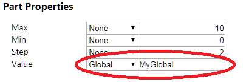

The text box next to the dropdown is the name of the global, in this case
"MyGlobal". Let's look at where the Globals are defined. Right click anywhere
on the dashboard and hit "Edit Globals", or press <kbd>Ctrl</kbd>+<kbd>G</kbd>.

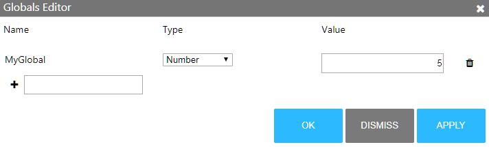

Notice that we already have a row for "MyGlobal"- try updating it, and pressing
"Apply". Notice that both the sliders updated in the background! Now close the
editor, move one of the sliders, and reopen the editor. The value of "MyGlobal"
updated as well!

Any option can be bound to a global. To demonstrate, create a new global and
call it "MyMaxValue". Set it's type to "Number", and hit OK.

<!-- note: "that dropdown" should get a name -->

Now, open the Part Properties editor for one of the sliders. Go to the "Value"
option and look at the text box next to the dropdown. This tells us what global
is currently bound to that option- change it to "MyMaxValue" and hit OK.

Now, select the other slider and open the Part Properties Editor. Go to the
"Max" option and look at the dropdown next to it. Set it to "Global", and bind
that option to "MyMaxValue". Hit OK, and drag one of the sliders. Notice that
the other slider's maximum updates.

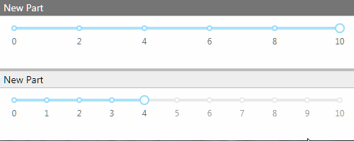

## Layout

MavenWorks' flexibility extends to the layout engine. It's very easy to make
changes to a dashboard, even changing the layout completely.

Click on one of the part titlebars, and drag it. Notice that the dashboard now
has dropzones highlighted. When you hover over the dropzones, the location of
the new part is highlighted in blue.

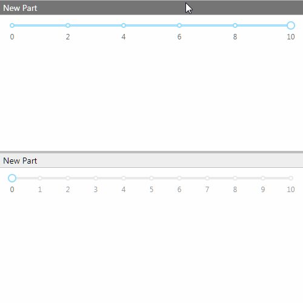

The layout appearance is controlled by "Layout Properties". You can edit these
in the Part Properties Editor (<kbd>Ctrl</kbd>+<kbd>E</kbd>, <kbd>Ctrl</kbd>+
<kbd>P</kbd>), or in the Dashboard Designer (<kbd>Ctrl</kbd>+<kbd>D</kbd>).

Open the designer now, and you'll see 3 panes:

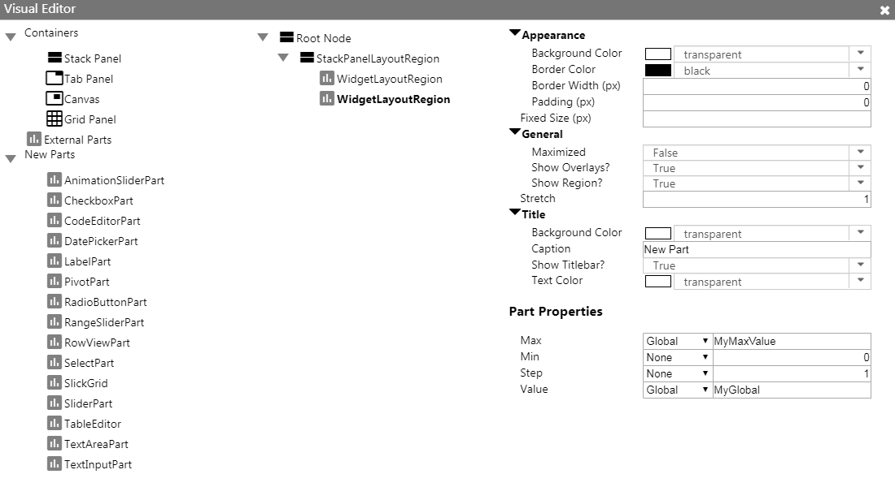

The left-most pane is new containers and parts you can add to the dashboard. The
middle pane is the layout, represented as a tree. You can click on individual
regions to edit their properties, which will appear on the right.

If you're ever unsure what a property does, hover over the property to see a
tooltip explaining what it does:

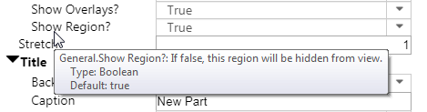

# Next steps

Now that you've built a dashboard, you're ready to dive in! In the app, you can
always press <kbd>F1</kbd> to open a help dialog that includes documentation and
examples.

<!-- note: add links here as appropriate -->