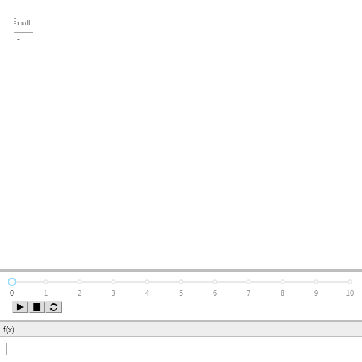
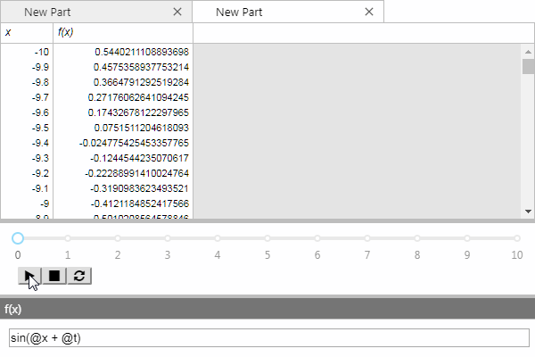
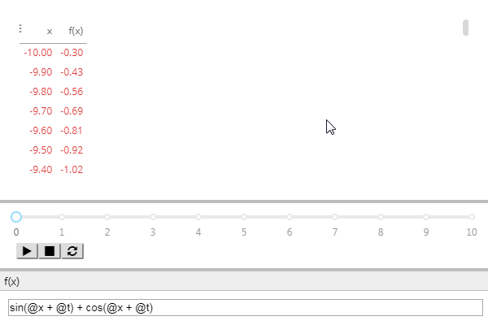
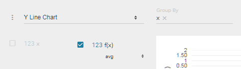
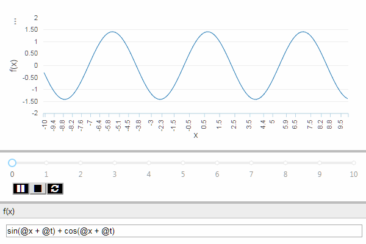

# Graphing Calculator

This is a fun project that will walk you through some of the more advanced bits
of Maven dashboarding, creating an animated 2D graphing calculator with a time
slider and an expression editor.

## Wireframing

Wireframing is always a good first step in designing a dashboard. It helps
clarify your thinking, and gives you a product you can begin iterating on right
away. This allows you to have shorter 'dev' cycles, to keep you from over-
investing in something users might not need or want.

Let's outline the requirements:

1. A graph
2. A time slider
3. An expression editor

Requirement 1 is simple- we'll use a PivotPart for this. 2. can be met with an
Animation Slider, and for 3 we can use a Text Input part. Now that we've
identified the parts we want to use, let's add them to our dashboard.

Re-arrange them until they look good to you. Remember that you can open the
designer at any time with (<kbd>Ctrl</kbd>+<kbd>D</kbd>) to make fine-tuned
adjustments! For this dashboard, you may want to try a layout like this:



## Globals

Now that we have the wireframe, let's determine what state will need to be
shared. We need the Expression synced up to the text box, the time synced up to
the slider, and both of those synced up to the graph. That means we'll need 2
globals:

1. `GraphFunction` (String)
2. `Time` (Number)

Add these globals via the Globals Editor (<kbd>Ctrl</kbd>+<kbd>G</kbd>) and go
ahead and bind them. `Time` should be bound to the slider value, and
`GraphFunction` should be bound to the text box. Hold off on binding them to the
graph, we'll get to that next.

## Query

Iterating on a query is sometimes a little difficult in an output part. Let's
create a SlickGrid and use that to help us write our query. Click on the Pivot
Part and create a new SlickGrid in-place with <kbd>Alt</kbd>+<kbd>T</kbd>. Now,
open the Query Editor with <kbd>Ctrl</kbd>+<kbd>E</kbd>,
<kbd>Ctrl</kbd>+<kbd>Q</kbd> and set the query type to MQL.

Let's start with a lattice. Enter the following query and hit "Apply":

```mql
SELECT
    x
FROM
    Lattice('x = -10 to 10 step 0.1')
```

You should see the slickgrid update with a set of numbers growing from -10 to
10, just as we specified in the lattice.

### MQL Functions

Now, let's create a simple MQL function. MQL functions are similar to those in
other SQL dialects, and begin with a `DEF`.

```mql
DEF @f(@x) = @x * @x

SELECT
    x,
    @f(x)
FROM
    Lattice('x = -10 to 10 step 0.1')
```

Now we're getting somewhere! Now, let's use that time global and integrate it
with our query. Recall that MQL lets you bind to globals [(just by referencing
them)](./queries#referencing-globals-in-bindings):

```mql
DEF @f(@x, @t) = @x * @x + @t

SELECT
    x,
    @f(x, @Time)
FROM
    Lattice('x = -10 to 10 step 0.1')
```

Now when you hit "Play" on the animation slider, the SlickGrid should update.

### MqlEval

Now that we've got a function, let's make it editable! For this, we'll use the
MqlEval function. MqlEval lets you turn a string into the body of a DEF. Let's
see how it works:

```mql
DEF @f(@x, @t) = MqlEval(@GraphFunction, 'x', @x, 't', @t)

SELECT
    x,
    @f(x, @Time) as [f(x)]
FROM
    Lattice('x = -10 to 10 step 0.1')
```

At this point, you should be able to edit the expression in the text box and
have the SlickGrid update. Set it to something like the following:

`sin(@x + @t) + cos(@x + @t)`



## Putting it all together

Now, close the Query Editor and let's shift our focus back to the Pivot Part.
There's a convenient shortcut to copy options from one part to another, let's
use that to save us some time. Click on the SlickGrid and press <kbd>Ctrl</kbd>+
<kbd>Shift</kbd>+<kbd>C</kbd>. This copies the MQL binding to an internal buffer
that we can paste from.

Now, switch to the PivotPart and press <kbd>Ctrl</kbd>+<kbd>Shift</kbd>+<kbd>V</kbd>.
This pastes the binding from that buffer, which in this case is the MQL query
that we had on the SlickGrid. Close the SlickGrid tab, since we don't need it
anymore.

You should now see this in the pivot part:



Now, expand the Perspective UI by clicking on the triple dots on the upper left,
and in the dropdown in the upper left change the visualization to "Y Line Graph".

From the columns in left, drag "x" to the Group By box at the top. Now, in the
columns on the left again look for the "f(x)" column and select it.

Your UI should look like this:



Now close the Perspective UI by clicking on the triple-dots again, and _voilà_!
You now have a fully functioning, animated graphing calculator!



> #### Note
>
> You may wish to disable the calculating overlays on the PivotPart, as they
> will briefly flash on occasion. To do this, open the Part Properties Editor
> (<kbd>Ctrl</kbd>+<kbd>E</kbd>, <kbd>Ctrl</kbd>+<kbd>P</kbd>) and set the
> layout property "Show Overlays?" to "False".
