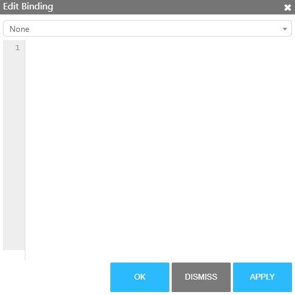
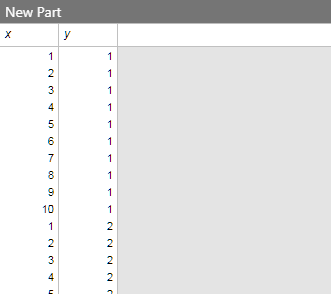
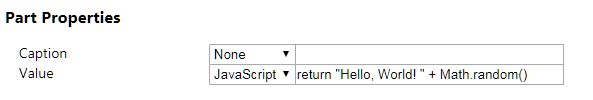
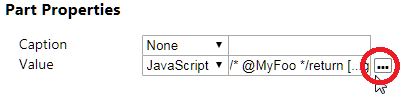
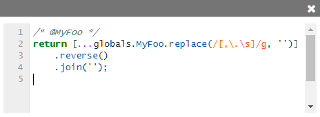
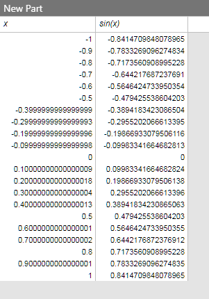

# Queries and Bindings

Bindings are a lot more powerful than simply linking sliders together. The other
types of bindings included by default on MavenWorks are:

 - [MQL Queries](#mql-queries)
 - [Javascript Bindings](#javascript-bindings)

## MQL Queries

MQL is a SQL dialect that allows for significant flexibility and runs right in
your browser. It comes with a number of built-in functions, and can reference
globals in the query.

### Hello Queries

Open a dashboard, and add a new SlickGrid with <kbd>Alt</kbd>+<kbd>T</kbd>.
Then, edit this part's query with <kbd>Ctrl</kbd>+<kbd>E</kbd>,
<kbd>Ctrl</kbd>+<kbd>Q</kbd> (or by right-clicking on the SlickGrid and pressing
"Edit Query"). You should see a dropdown and a code editor.



Enter the following query and hit OK:

```mql
SELECT
    x, y
FROM
    Lattice('x = 1 to 10 step 1, y = 1 to 10 step 1')
```

The SlickGrid should now update with the query results:



### Variables

In some SQL dialects, you can create a variable using a `SET` statement. MQL is
no different:

```mql
SET @answer = 42

SELECT @answer FROM dual
```

> `dual` is a built-in dummy database

### Interactivity

Globals can be referenced in the same way. Create a global named MyGlobalAnswer,
and set it's value to 42.

<!-- TODO: it'd be nice to have a true aside -->
> #### Referencing globals in bindings
>
> To reference a global, you can reference it as a normal variable. Just prepend
> the global name with an at-sign (`@`), like so:
>
> ```mql
> SELECT @MyGlobalAnswer from dual
> ```
>
> MQL will automatically detect these globals, and re-run your query whenever
> the global changes.
>
> ##### Alternate syntax
>
> You can alternatively specify global subscriptions more explicitly, using a
> magic comment. These are block comments on the very first line of the binding
> that have a comma-separated list of globals preceeded by at-signs (`@`). These
> work regardless of what binding type you're using. For instance, you could use
> this instead:
>
> ```mql
> /* @MyGlobalAnswer */
>
> SELECT @MyGlobalAnswer from dual
> ```
>
> You shouldn't normally need to use this format in MQL or JS bindings.
>

Now, change the query of the SlickGrid we created above to:

```mql

SELECT
    @MyGlobalAnswer,
FROM
    dual
```

When you change the value of MyGlobalAnswer, the query will automatically re-run
with the new value.

### Column Expressions and Aliases

You can use arbitrary expressions in the `SELECT` statement:

```mql
SELECT
    x,
    1 + x
FROM
    Lattice('x = 1 to 10 step 1')
```

If you want to rename them, use `AS` followed by the name. If you need to quote
the name, use square brackets:

```mql
SELECT
    42 as Answer,
    'hello' as [A simple string]
FROM
    dual
```

### Grouping

#### SQL-style

MQL supports SQL-style grouping:

```mql
SELECT
    avg(x),
    'test'
FROM
    Lattice('x = 1 to 10 step 1')
GROUP BY x
```

> Unlike most SQL dialects, MQL does _not_ require all selected columns to
> appear in the grouping expression. This means that we don't need to worry
> about the 'test' column above.

#### Grouping `WITH ROLLUP`

MQL also supports a hierarchal grouping mode that groups rows into aggregates.
This grouping mode is powerful, and not unlike row pivoting available in other
engines.

```mql
SELECT
    avg(x),
    y
FROM
    Lattice('x = 1 to 10 step 1, y = 1 to 10 step 2')
GROUP BY x WITH ROLLUP
```

### Fetching Data

In MQL, you can fetch remote data over HTTP using the `Fetch` function. In the
example below, we pull a CSV off of GitHub, cache it, parse it, and use it in
a query.

```mql
set @data = StaticCache('my-data', Fetch('https://raw.githubusercontent.com/plotly/datasets/master/hello-world-stock.csv'))

SELECT
    Stock,
    AdjOpen,
    AdjClose,
    AdjHigh,
    AdjLow
FROM
    CsvToTable(@data)
GROUP BY Stock WITH ROLLUP
```

> #### A note on caching
> It is good practice to cache the result of `Fetch`. This will make the query
> much snappier on subsequent runs, and reduce the impact of refreshing a query
> on a remote server. The `StaticCache` function does this, taking a cache key
> as the first argument and an expression to cache as the second. If the key is
> in the cache, the expression is not evaluated and the cached value is returned
> instead.

## Javascript Bindings

The other binding type that comes with MavenWorks is a Javascript runner. Javascript
is more complex than MQL, but also much more powerful. Javascript bindings can
call out to MQL, and have access to a Table helper for working with MavenWorks
tables.

### Hello JS

<!-- I didn't want to introduce the `Table` class or the mql template just yet,
    so we go with a bit more 'awkward' route with a label part instead. -->

In this example we're going to write a very simple JS binding. Open a new
dashboard, add a LabelPart (<kbd>Alt</kbd>+<kbd>Shift</kbd>+<kbd>T</kbd>), and
edit it's part properties with <kbd>Ctrl</kbd>+<kbd>E</kbd>, <kbd>Ctrl</kbd>+
<kbd>P</kbd> (or by right-clicking on the LabelPart and pressing "Edit Part
Properties").

Next to the "Value" property, change the dropdown to "JavaScript" and type in
the following snippet into the text box:

```js
return "Hello, " + "World! " + Math.random()
```



You should see something like the following in your label part:


> #### Function format
> It may seem a little strange having a bare `return` there. A JS binding is
> actually the "body" of a function, not an independent script. This is done for
> security reasons, since it runs on your browser.

### Referencing Globals

Referencing globals is similar to MQL [(see the note on comment formats)](#referencing-globals-in-bindings).
The only difference is that globals are referenced with `globals.<global name>`.

For example, building off the example above, open the Globals Editor (<kbd>Ctrl</kbd>+<kbd>G</kbd>)
and add a new global named "MyFoo". Set the type to "String", and set the value
to "Gnorts, Mr. Alien". Now, in the label part binding, enter the following:

```js
return [...globals.MyFoo.replace(/[,\.\s]/g, '')]
    .reverse()
    .join('');
```

> You may find it a bit more ergonomic to use the 'popup' editor for this binding.
> Hover over the option with your mouse, and click on the triple-dot button to the
> right of the text box:
>
> 
>
> Press it to open a pop-up multiline code editor:
>
> 

You should now see the name of a famous astronaut in your label part.

### Running MQL

JS bindings have access to MQL in a few different ways:

 - [`mql` tag](#mql-tagged-template)
 - [`RunMql` function](#runmql-function)

These have their uses, but usually you will want to use the `mql` tag detailed
below.

#### `mql` Tagged Template

The "`mql` tag" is the most useful way of using MQL in JS bindings. It allows
you to seamlessly integrate JS functions and MQL, giving you flexibility far
beyond what query languages can normally offer.

##### Example

<!-- note: We need to rename "query" binding editor and "binding" global editor,
    or maybe merge them. -->

In an empty dashboard, create a new SlickGrid (<kbd>Alt</kbd>+<kbd>T</kbd>) and
edit it's "query" binding (<kbd>Ctrl</kbd>+<kbd>E</kbd>, <kbd>Ctrl</kbd>+<kbd>Q</kbd>).
Change the dropdown to "JavaScript" and enter the following:

```jsmql
function MySinFunction(_, colValue) {
    return Math.sin(colValue);
}

return mql`
SELECT
    x,
    ${MySinFunction}(x) as [sin(x)]
FROM
    Lattice('x = -1 to 1 step 0.1')`;
```

You should see a table of X-values and their sines:



##### How it works

In the templater, you can place JS functions in between `${` and `}`. The first
argument passed to the function is the row being operated on, and the rest are
any arguments passed in the query. In the example above, `MySinFunction` is
passed the `x` column, so that is given as the second argument.

JS Functions can appear anywhere an MQL function can; such as the `SELECT`
clause, or the `HAVING` clause, or `GROUP BY`, or `WHERE`, or even in the `FROM`
clause.

Literals and variables can also be passed using these template braces. For
instance, the following works:

```jsmql
const foo = "Hello, MQL.js!"
return mql`
SELECT
    ${foo} as [my constant]
FROM
    dual`;
```

> ##### Asynchronicity
> The `mql` function is _asynchronous_, which means it returns a [`Promise`](https://developer.mozilla.org/en-US/docs/Web/JavaScript/Reference/Global_Objects/Promise).
> That means that if you want to use the result of an MQL query elsewhere in
> your javascript binding, you'll have to `await` it to use the response.
> For example:
>
> ```jsmql
> const tbl = await mql`SELECT null FROM dual`;
> return tbl.rows[0].getValue(0);
> ```

#### `RunMql` Function

The `RunMql` function is simpler, and less flexible. You can use this to run a
string as an MQL query, or to pass parameters into an MQL query without
templating. For example:

```js
const queryStr = "SELECT @myVal FROM dual";
return RunMql(queryStr, {
    myVal: "foo"
})
```

<!-- Note: We should also link to the Table and TableHelper docs once we start
    generating those -->
